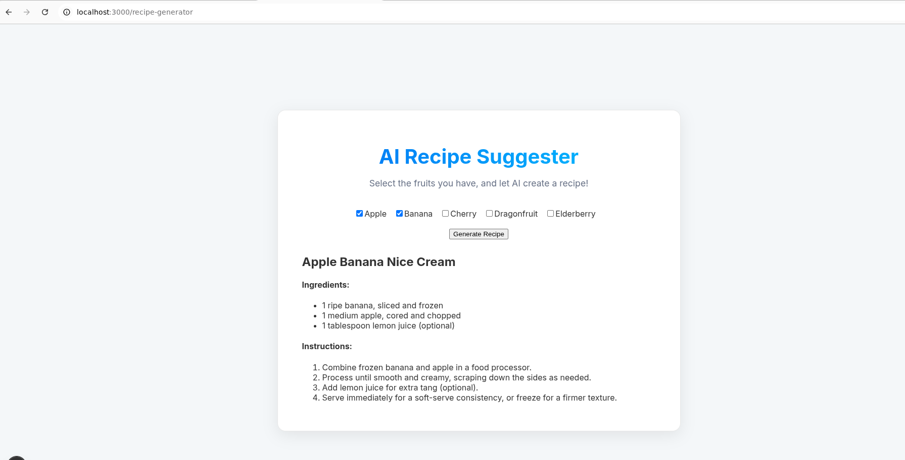
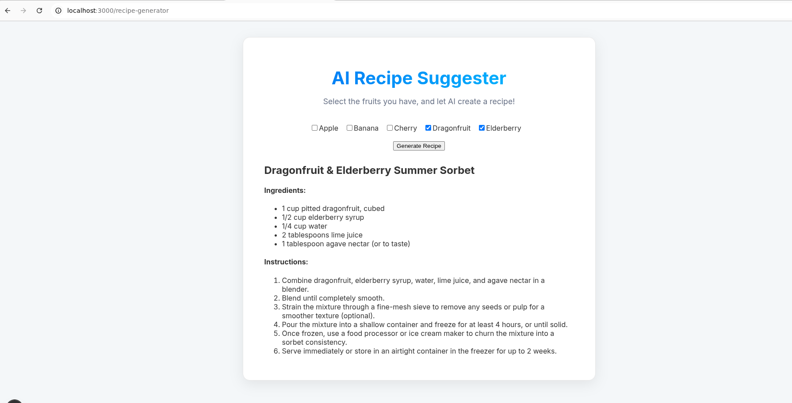
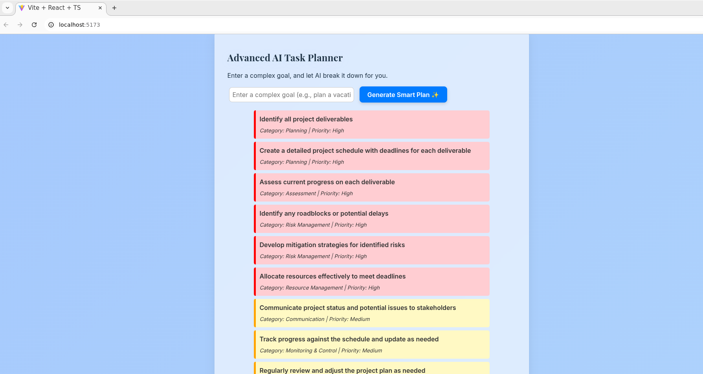

# Use case 1: **AI Recipe Suggester - Day 5 Frontend AI Project ( Aman Jha )**


This project is an enhancement of a Day 4 Next.js application, fulfilling the requirements for the "Day 5: AI in Frontend – LLMs & Generative Components" assignment. It implements a dynamic, interactive, and intelligent tool that connects to the **live Google Gemini API** to help users create recipes from ingredients they already have.

### **Use Case Description**

Many people struggle with deciding what to cook based on the ingredients available at home, leading to food waste or uninspired meals. The **AI Recipe Suggester** tackles this problem by providing a fun and creative solution. A user selects from a list of available ingredients, and the application calls the **Google Gemini Pro model** to act as a creative chef. The AI generates a unique recipe in real-time, complete with a title, a formatted ingredient list, and step-by-step instructions.

This project implements a powerful and secure architecture for integrating live generative AI in a modern web application.

---

# **AI Recipe Suggester 🧑‍🍳**

Ever stare into your fridge, see a random collection of ingredients, and have absolutely no idea what to make? This project is my answer to that exact problem.

This started as a simple assignment for Day 4 of a frontend workshop, just displaying a list of fruits. For my Day 5 assignment on AI, I decided to give it a major upgrade. Instead of just *showing* ingredients, what if the app could *use* them to create something new?

That was the spark for the **AI Recipe Suggester**: a smart kitchen assistant that connects to Google's live Gemini AI to dream up unique recipes on the fly based on the ingredients you have on hand.

## Screenshots
| Page Type | Screenshot |
| :--- | :--- |
| **Counter**<br/>*By apple & banana - Created nice cream* | ) |
| **Dragonfruit & Elderberry Summer Sorbet**<br/>*By Dragon fruits & Elderberry* | |

---

### **The Magic: How It Actually Works**

The user experience is simple, but the architecture underneath is what makes it powerful and secure.

1.  **You Pick Your Ingredients:** On the `/recipe-generator` page, you check off the fruits you want to use.
2.  **A Secure Request is Made:** Your choices are sent to a private API route I built within the Next.js app. **Your browser never talks to the AI directly.**
3.  **The Server Takes Over:** My backend API route securely calls the Google Gemini AI, using a secret API key that stays safely on the server. I've specifically instructed the AI to act like a creative chef and to respond only in a clean, structured JSON format.
4.  **A Recipe is Born:** The AI generates a brand new recipe and sends it back as structured data (a title, an array of ingredients, and an array of instructions).
5.  **Beautifully Displayed:** The frontend receives this clean data and renders it in a user-friendly, easy-to-read format.

### **Checking Off the Assignment Boxes (My Day 5 Goals)**

This project was built to meet specific learning objectives, and I'm proud of how it turned out.

*   **A True Generative Component:** The heart of the app is the `RecipeGeneratorPage`. It’s not just displaying data; it’s an interactive tool that generates new, unique content every time you use it.

*   **A Major Functional Upgrade:** This wasn't just a small addition. I transformed the original, static app into something dynamic, useful, and truly interactive. The biggest enhancement was building the secure, server-side architecture to handle the AI, which is how professional applications are built.

*   **Rock-Solid Testing:** You can't build something this cool without making sure it doesn't break. I wrote a comprehensive test suite for both the frontend and the backend API, covering:
    *   **Happy Paths:** Does it work when the user does everything right?
    *   **Negative Cases:** What happens if the network fails or the user clicks buttons in the wrong order?
    *   **Edge Cases:** Does the app handle weird inputs gracefully?

*   **A Working Codebase:** This repository is the complete, functional result of that work.

### Appropriate Testcases with AI

A major focus of this project was creating a robust testing suite to prove the reliability of the AI integration architecture. We created dedicated test files for both the frontend and the backend, covering a full range of scenarios:

*   **API Route Tests (`/pages/api/__tests__/generate-recipe.test.ts`):**
    *   **Positive Case:** Validates that a correct request successfully calls the backend service and returns a 200 status.
    *   **Negative Cases:** Confirms that the API correctly handles non-POST requests (405) and internal service failures (500).
    *   **Edge Cases:** Ensures the API rejects requests with invalid bodies, such as an empty `fruits` array.

*   **Frontend Component Tests (`/pages/__tests__/recipe-generator.test.tsx`):**
    *   **Positive Case:** Simulates the full user journey from selecting ingredients to clicking "Generate" and seeing the final recipe appear.
    *   **Negative Cases:** Verifies that both client-side and server-side errors are gracefully handled.
    *   **Edge Cases:** Checks complex user behavior, like ensuring an old recipe is correctly replaced when a new one is generated.

---

## **How the AI Integration Works**

The application follows a secure, full-stack architecture to interact with the Google Gemini API.

1.  **Frontend (`RecipeGeneratorPage.tsx`):** The user selects ingredients and clicks "Generate". A `fetch` request is sent to our internal Next.js API route.
2.  **API Route (`/api/generate-recipe.ts`):** This server-side route receives the request and calls the `callLlmApi` function from our dedicated service.
3.  **Service (`services/recipeService.ts`):** This file contains the core logic. It uses the official `@google/generative-ai` SDK to securely connect to the Google API using the secret key from `.env.local`. It prompts the `gemini-1.5-flash-latest` model to generate a recipe in a specific JSON format.
4.  **Response:** The structured JSON is passed back through the API route to the frontend, where it is rendered for the user.

## **Local Setup and Installation**

To run this project with a live AI connection, follow these steps:

**1. Clone the Repository**
```bash
git clone https://github.com/Amaninreal/pi-shaped-frontend-Aman.git
cd pi-shaped-frontend-Aman/Reactbasics_workshop-Aman/day5/next-rendering-demo
```

**2. Install Dependencies**
```bash
npm install
npm install @google/generative-ai
```

**3. Get Your Google AI API Key**
-   Go to **[Google AI Studio](https://aistudio.google.com/)**.
-   Sign in and click **"Get API key"** -> **"Create API key in new project"**.
-   Copy the generated key.

**4. Set Up Environment Variables**
-   In the root of the `next-rendering-demo` directory, create a new file named `.env.local`.
-   Add your Google AI API key to this file:
  ```
  # .env.local
  GEMINI_API_KEY="paste_your_google_ai_key_here"
  ```

**5. Enable the API in Google Cloud Console**
This is a mandatory one-time setup step for Google Cloud.
-   The first time you run the app, you will likely see a `403 Forbidden` error in your terminal with a long URL.
-   **Copy that URL** and paste it into your browser.
-   It will take you to th        {/* --- End of the AI Task Planner section --- */}e Google Cloud Console page for the "Generative Language API".
-   Click the blue **"ENABLE"** button.
-   Wait about a minute for the setting to apply.

**6. Run the Development Server**
Restart your server to load the new environment variables.
```bash
npm run dev
```
Open [http://localhost:3000](http://localhost:3000) in your browser, navigate to `/recipe-generator`, and try it out!

## **Running Tests**

To run the complete test suite (which mocks the AI service to avoid API calls), use the following command:

```bash
npm test
```

---

# Use case 2: **Advanced AI Task Planner**


This project is the second part of my Day 5 assignment on "AI in Frontend." I've taken a component showcase app from Day 3 and transformed its simple form into an **intelligent planning assistant**. It connects directly to the live **Google Gemini API** to break down complex goals into structured, prioritized, and actionable plans.

### **The Use Case: From Overwhelmed to Organized**

We've all been there: facing a big project and staring at a blank to-do list, not knowing where to start. This tool is my solution to that exact problem. Instead of just adding a single, overwhelming task like "Launch a new podcast," I can now leverage the power of AI to instantly generate a clear, step-by-step plan.

The goal was to create a tool that acts like an expert project manager, reducing the mental load of planning and helping me get started right away.

---

## Screenshots
| Page Type | Screenshot |
| :--- | :--- |
| **Advanced AI Task Planner**<br/>*prompt - make my project deadline deliverables* |  |


### **Live Demo in Action**

The best way to see the power of this tool is to see how it handles different kinds of requests. I ran three prompts in a single session to test its intelligence and robustness. The app is designed to **append** new plans to the list, which lets me plan multiple projects at once.

Here's the final output from my live test session:

```
// --- 1. First, I entered a complex, contextual goal: "make my project deadline deliverables" ---
Define project scope and objectives
Category: Planning | Priority: High
Identify key deliverables and milestones
Category: Planning | Priority: High
Create a detailed project schedule
Category: Planning | Priority: High
Allocate resources (personnel, budget, tools)
Category: Planning | Priority: High
Develop a communication plan
Category: Planning | Priority: Medium
Identify potential risks and develop mitigation strategies
Category: Planning | Priority: Medium
Establish a quality assurance plan
Category: Planning | Priority: Medium
Determine project success metrics
Category: Planning | Priority: Medium
Document all planning decisions and assumptions
Category: Planning | Priority: Low
Obtain necessary approvals for the project plan
Category: Planning | Priority: High

// --- 2. Next, I tried a simple, everyday task: "Email my manager about the report" ---
Compose the email body, including key findings and next steps.
Category: Execution | Priority: High
Attach the report to the email.
Category: Execution | Priority: High
Review the email for clarity, grammar, and professionalism.
Category: Execution | Priority: Medium
Send the email to the manager.
Category: Execution | Priority: High
Confirm email delivery.
Category: Execution | Priority: Low

// --- 3. Finally, I gave it an off-topic question: "What is the weather today?" ---
Identify the user's location
Category: Planning | Priority: High
Access a reliable weather API or website
Category: Research | Priority: High
Query the selected data source for current weather information in Kanpur.
Category: Execution | Priority: High
...and so on...
```
This single session proves the AI is not just a dumb machine. It understands context, handles simple and complex tasks differently, and follows my instructions to stay on topic, making it a truly useful and reliable assistant.

---

### **Meeting the Goals**

*   **A True Generative Component:** The `AddItemForm.tsx` component was successfully transformed into an intelligent, generative tool that creates new, structured content based on user input.

*   **A Major Functional Enhancement:** The upgrade from the original app is massive:
    *   **Live AI Integration:** The app is now powered by the live Google Gemini API.
    *   **Structured Data Generation:** The AI returns structured JSON (`{text, category, priority}`), not just plain text. This is a huge leap in functionality that allows the UI to be truly intelligent.
    *   **Dynamic UI:** The frontend uses this structured data to create a rich user experience, with task colors changing based on the AI-assigned priority.

*   **Appropriate Test Cases:** I built a full suite of unit tests using **Vitest** and **React Testing Library** to mock the AI service and verify all positive, negative, and edge cases. The live demo above also serves as a real-world, end-to-end test.

*   **A Working Codebase:** This repository contains the complete, functional code for the enhanced application, including the new testing setup.

### **Technical Architecture**

As a client-side React application built with Vite, the architecture is straightforward but effective:

1.  **UI (`AddItemForm.tsx`):** The user enters a goal and clicks the button.
2.  **Service (`services/llmService.ts`):** The click handler calls our dedicated service function, which runs **in the browser**.
3.  **Live API Call:** The service uses the `@google/generative-ai` SDK to make a direct call to the Gemini API, authenticating with a key from the `.env` file.
4.  **State Update (`App.tsx`):** The structured JSON response is passed back to the main `App.tsx` component, which updates its state and renders the new list of tasks.

### **Getting It Running On Your Machine**

Here’s how to set up and run the project yourself.

**1. Clone the Repository**
```bash
git clone https://github.com/Amaninreal/pi-shaped-frontend-Aman.git
cd pi-shaped-frontend-Aman/Reactbasics_workshop-Aman/day5/my-app
```

**2. Install Dependencies**
```bash
npm install
```

**3. Get Your Google AI API Key**
-   Go to **[Google AI Studio](https://aistudio.google.com/)**, sign in, and create a new API key.

**4. Set Up Environment Variables**
-   In the `day3/my-app/` directory, create a file named `.env`.
-   Add your key to this file, making sure to use the `VITE_` prefix, which is required by Vite:
  ```
  # .env
  VITE_GEMINI_API_KEY="paste_your_google_ai_key_here"
  ```

**5. Enable the API (A One-Time Step)**
-   Run the app (`npm run dev`). The first time you try to generate a plan, you will likely see a `403 Forbidden` error in your browser's developer console.
-   This error message will contain a long URL. Copy it, paste it into your browser, and click the blue **"ENABLE"** button.

**6. Run the App**
-   Restart your development server to load the new environment variable:
  ```bash
  # Stop with Ctrl + C, then restart
  npm run dev
  ```
The application will be running on `http://localhost:5173`.

### **Running Tests**

I have configured the project with **Vitest**, the modern testing framework for Vite. To run the tests:

```bash
npm test
```
